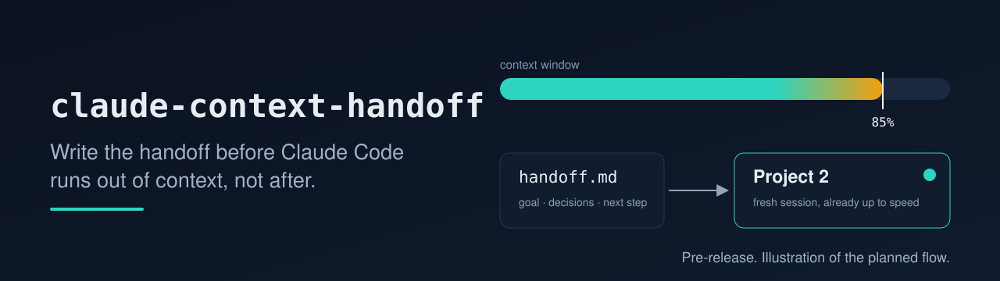

  

<h3 align="center">Write the handoff before Claude Code runs out of context, not after.</h3>

  Designed to write a structured handoff when your context window reaches a percentage you choose, so your next session can start already up to speed. 
  Planned for Claude Code in the terminal, VS Code, JetBrains and the Claude desktop app.

  
  

> **Pre-release. Not installable yet.** This repository is public early so the name, design and plan are visible. Nothing here has shipped: every statement about this project describes intended design, not working software. There is no release to install. This notice comes off only when the claims are backed by passing tests. Releases will be announced on this page.

> claude-context-handoff is an independent open source project. It is not affiliated with, endorsed by, or sponsored by Anthropic. Claude and Claude Code are trademarks of Anthropic, PBC.

## What is it designed to do?

1. Read your context usage from the Claude Code status line and save it per session.
2. At your threshold (default 85 percent), wait for the end of a turn, then have Claude write a handoff file.
3. Give you a one-line resume prompt for the next session.
4. For the Claude desktop app: open the next session in the right folder with the prompt ready, then rename and pin it and unpin the old one. None of it is automated or tested yet.

## How is this different from /compact?

`/compact` summarizes the conversation inside the same session. A handoff is designed to write the working state to a file you control and start a clean context. The two are meant to work together: compact buys time, and a handoff is designed to give you a fresh start with explicit next steps.

## What is the planned focus?

The plan is built around three things: a configurable threshold that waits for a natural pause, an installer that never overwrites existing settings, and, for the Claude desktop app, a numbered and pinned chain of sessions. None of that has shipped yet. See [Related projects](#related-projects) below for other approaches. A fair side-by-side comparison will be added after the first release.

## How will it decide when to hand off?

| Setting | Planned default | Meaning |
|---|---|---|
| `threshold` | 85 | Start looking for a pause at this context percent |
| `hard_ceiling` | 92 | At this percent, nudge Claude to wrap up and hand off at the next turn end |
| `enabled` | true | Set false in a project to opt out |

A handoff can only run at the end of a turn, when Claude has stopped. If a single long turn crosses the hard ceiling, the design can only nudge Claude to finish up. It cannot interrupt a running turn.

## What will go in the handoff?

Goal, decisions with the reason, the exact next step, files touched, open questions, git state, running processes, and commands that verify the work. Pointers to files, not pasted contents.

Planned: best-effort redaction of common secret formats before a handoff is written. It cannot catch everything, so read a handoff before sharing it.

## Which Claude Code surfaces are planned?

| Surface | Write the handoff | Open the next session |
|---|---|---|
| Terminal CLI | planned | you paste a one-line resume prompt |
| VS Code and forks | planned | you paste a one-line resume prompt |
| JetBrains | planned | you paste a one-line resume prompt |
| Claude desktop app | planned | experimental: new session, rename, pin. **Unverified.** |
| Web sessions | unverified | unverified |

## Install

Coming with the first tested release. Planned: one plugin command or `npx`, an installer that backs up and merges `settings.json` (it never overwrites an existing status line), plus `handoff doctor`, `handoff --dry-run` and `handoff uninstall`.

## Design commitments

These are goals, not yet verified. Each is planned to get an automated check before the first release:

- Zero runtime dependencies.
- This tool makes no network calls of its own. Claude Code still talks to Anthropic, and Claude writes the handoff, so a handoff uses tokens.
- No telemetry.
- Local state only.
- Settings backed up before any change, a clean uninstall, and a per-session opt-out.

## Related projects

Community tools that take on parts of the same problem:

- [willseltzer/claude-handoff](https://github.com/willseltzer/claude-handoff): handoff documents for moving work into a fresh session
- [REMvisual/claude-handoff](https://github.com/REMvisual/claude-handoff): Claude Code skills for session handoffs that survive context compaction and chain-link across sessions
- [kylesnowschwartz/claude-handoff](https://github.com/kylesnowschwartz/claude-handoff): a handoff tool that builds on `/compact`
- [Sonovore/claude-code-handoff](https://github.com/Sonovore/claude-code-handoff): session handoff command and hooks to save and restore context across sessions
- [thepushkarp/handoff](https://github.com/thepushkarp/handoff): Claude Code plugin to preserve and restore context between sessions
- [parcadei/Continuous-Claude-v3](https://github.com/parcadei/Continuous-Claude-v3): a broader context management system with hooks, ledgers, handoffs and agent orchestration

From the same author: [seven7rees/claude-handoff](https://github.com/seven7rees/claude-handoff), a manual `/handoff` command that this project aims to automate.

## License

MIT. See [LICENSE](LICENSE).
